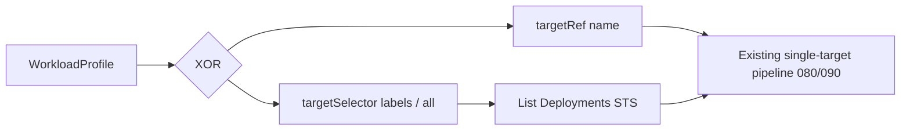

# LLD-085: Bulk target selection (namespace, labels, cluster-wide)

## Purpose

Define how autosizing policy can apply to **many** workloads: all matching workloads in a namespace, workloads selected by **labels**, and (optionally) **cluster-wide** selection across namespaces. Today ([020](./020-target-resolution.md)) one `WorkloadProfile` resolves to exactly one `Deployment` or `StatefulSet` by name in the profile’s namespace. This LLD specifies API shape, reconciliation semantics, conflict rules, RBAC, and migration so implementation can proceed without ad hoc one-off behavior.

## Spec traceability

| Spec § | Requirement (summary) |
|--------|------------------------|
| §2 | Included: Deployments, StatefulSets — bulk selection still **only** these kinds unless spec expands |
| §4 | **Amendment:** `spec` must allow either named `targetRef` **or** a declared selection strategy (mutually exclusive); status/conditions must reflect multi-target or selector resolution |
| §10 | `resolveTarget` becomes `resolveTargets` (list) or equivalent — reconcile only after target set known |
| §16 | No direct Pod mutation — selection resolves to parent workloads only |

**Authoritative spec update:** Before marking this LLD `implemented`, add a **§4.x Bulk selection** (or equivalent) subsection to [autosize-controller-spec.md](../../spec/autosize-controller-spec.md) that restates the mutual exclusivity, selector semantics, and cluster-wide rules below so spec and LLD stay aligned ([000](./000-doc-conventions.md)).

## Scope and non-goals

**In scope:**

- API fields (namespaced `WorkloadProfile` extension and/or optional cluster-scoped kind).
- Listing `Deployment` / `StatefulSet` by namespace + label selector; optional “all in namespace” with explicit safety flag.
- Cluster-wide: selection across namespaces via `namespaceSelector` and workload `labelSelector` (or documented alternative).
- Conflict policy when two profiles match the same workload.
- Conditions, metrics, and test expectations for the selector path.

**Out of scope:**

- CronJob, DaemonSet, ReplicaSet-as-target (spec §2 limits kinds unless spec changes).
- Changing kubelet or aggregate math (030, 040) — only how many reconcile “pipelines” run.
- Admission webhook defaulting for unlabeled pods (110) — may interact later; note only in Open questions.

## Dependencies

- **Upstream:** [010-workloadprofile-api.md](./010-workloadprofile-api.md), [020-target-resolution.md](./020-target-resolution.md), [080-observe-reconcile.md](./080-observe-reconcile.md), [090-actuation.md](./090-actuation.md), [100-packaging-rbac.md](./100-packaging-rbac.md)
- **Downstream:** implementation in [`internal/target`](../../../internal/target), [`internal/controller`](../../../internal/controller); RBAC in [`config/rbac`](../../../config/rbac)

## Data model / API surface

### Design options (choose one for v1 of feature)

| Option | Description | Pros | Cons |
|--------|----------------|------|------|
| **A — Extend `WorkloadProfile` (namespaced)** | Add optional fields alongside `targetRef`; exactly one of `targetRef` **or** selector block set | Single kind; familiar YAML | Cluster-wide needs another object or verbose namespace list |
| **B — New cluster-scoped kind** | e.g. `ClusterWorkloadProfile` / `AutosizePolicy` with `namespaceSelector` + workload `labelSelector` + shared `mode`/`containers` | Clean RBAC story for cluster operators | Two kinds to document and reconcile |
| **C — Generator only** | External tool emits N `WorkloadProfile` YAMLs | No controller change | Not in-cluster UX |

**Recommendation for this repository:** implement **Option A** first (namespace-scoped selectors), then **Option B** if product requires first-class cluster-wide policy without generating many CRs.

### Option A — Proposed `WorkloadProfile` spec additions (mutually exclusive with `targetRef`)

```yaml
# Exactly one of:
#   - spec.targetRef (current behavior), OR
#   - spec.targetSelector (new)

spec:
  # Existing — omit when using targetSelector
  # targetRef:
  #   kind: Deployment
  #   name: my-app

  targetSelector:
    # Namespace for resolution is always metadata.namespace of the WorkloadProfile (unchanged).
    # If labelSelector is nil/empty:
    #   - MUST NOT match all workloads unless selectAllWorkloadsInNamespace: true (explicit opt-in).
    labelSelector:
      matchLabels:
        app.kubernetes.io/part-of: payments
      # matchExpressions: ...

    # Explicit opt-in to select every Deployment and StatefulSet in the namespace (high blast radius).
    selectAllWorkloadsInNamespace: false

    # Optional: restrict by kind; default both true if omitted.
    kinds:
      deployment: true
      statefulSet: true
```

**Validation (webhook or CRD):**

- XOR: `targetRef` set XOR `targetSelector` set (not both, not neither).
- If `targetSelector.labelSelector` empty/absent and `selectAllWorkloadsInNamespace` is false → reject.
- `kinds` must not both be false.

### Option B — Cluster-scoped kind (sketch)

- `apiVersion: autosize.saturdai.auto/v1`
- `kind: ClusterWorkloadProfile` (name TBD)
- Fields: `namespaceSelector` (labels on `Namespace` objects), workload `labelSelector`, same `mode`, `containers`, `cooldownMinutes`, `collectionIntervalSeconds` as `WorkloadProfile`.
- **Does not** use `metadata.namespace` for workload scope; uses selectors only.
- Status: aggregated health + per-namespace slice or `status.summary` counts — detailed shape belongs in a follow-up edit to 010 once chosen.

### Conflict resolution

When multiple profiles (same or different namespaces) **select the same** `Deployment`/`StatefulSet`:

| Policy | Behavior |
|--------|----------|
| **Recommended default** | **Deny overlap:** newer or lower-precedence profile sets `TargetResolved=False` (or dedicated `SelectorConflict=True`) with reason `OverlappingSelector`; no actuation for conflicting targets. |
| **Alternative** | Deterministic precedence: higher `priority` integer on spec wins; document tie-breaker |

Pick one in implementation; default table row is the safe choice.

## Algorithms and invariants

1. **Resolve step:** Build candidate list: `List` Deployments and StatefulSets in profile namespace with `labelSelector` (if set); if `selectAllWorkloadsInNamespace`, list all Deployments and StatefulSets in namespace (subject to `kinds`).
2. **Cardinality:** Either:
   - **Fan-out CRs (optional implementation):** controller creates/updates one `WorkloadProfile` per target with owner reference to parent — status stays one-workload per CR (matches current 010 shape), **or**
   - **Single CR multi-status:** extend `status` with `targets[]` entries (larger etcd risk — document max targets, e.g. 50, with validation).
3. **Recommendation:** Prefer **fan-out child `WorkloadProfile`** or **separate reconciler object per target** to reuse existing single-target pipeline (080/090) with minimal change to aggregate/status size limits (010).
4. **Requeue:** Worst-case requeue across targets is bounded; label changes on workloads trigger watches on `Deployment`/`StatefulSet` if using `Owns` or `Watches` mapping back to profile.
5. **Cluster-wide (Option B):** For each matched namespace, same as (1); total work is O(namespaces × workloads) — require rate limits or shard by namespace in metrics.

## Failure modes and behavior

| Condition | Behavior |
|-----------|----------|
| No workloads match selector | `TargetResolved=False`, reason `NoTargetsFound`; no kubelet traffic |
| Selector matches &gt; max allowed | Reject at admission or trim with `PartialTargets=True` — **must** document which |
| RBAC cannot list workloads in namespace | Error; requeue; condition `Forbidden` |
| Overlap with another profile | See conflict table; no actuation for disputed workloads |

## Security / RBAC

- **Option A:** No change to namespace-scoped controller SA if it already has `list/watch` Deployments and StatefulSets in watched namespaces (100).
- **Option B:** ClusterRole must allow `list/watch` Deployments and StatefulSets **cluster-wide** (or scoped by `ResourceNames` if using a constrained design — uncommon for selectors). Namespace `list/watch` needed for `namespaceSelector` evaluation.
- Document **least privilege** alternative: operator deploys separate controller instance per team namespace with namespace-scoped Role only — cluster-wide feature opt-in via separate install profile.

## Observability

- Logs: `selectorProfile`, `namespace`, `matchCount`, `targetKind`, `targetName`, `conflictWith` (if any).
- Metrics: `autosize_selector_resolve_total{result}`, `autosize_selector_targets_matched` (histogram or gauge), `autosize_selector_conflicts_total`.

## Test plan

- **Unit:** XOR validation; empty selector without opt-in fails; overlap detection between two fake object sets.
- **Integration (envtest):** Namespace with three Deployments, label on two — profile selects two; actuation gated as today.
- **Integration:** Two profiles same label set — expect conflict condition on second reconciler.
- **Acceptance:** `selectAllWorkloadsInNamespace: true` lists all Deployments/STS; no DaemonSets.

## Rollout / migration

1. Ship CRD defaults + validation webhook (if not already present for XOR).
2. Document migration from many hand-written `WorkloadProfile` YAMLs → one selector-based profile (if using fan-out, document garbage-collection of child objects on parent delete).
3. Feature flag optional: `AUTOSIZE_SELECTOR_TARGETS=true` for first release.

## Open questions

- **Fan-out vs multi-status:** Confirm fan-out child `WorkloadProfile` as default to preserve etcd budgets (010).
- **Spec PR:** Who authors §4.x in [autosize-controller-spec.md](../../spec/autosize-controller-spec.md) before `implemented`.
- **Webhook:** Whether global defaults (120) merge differently for selector-based profiles.


