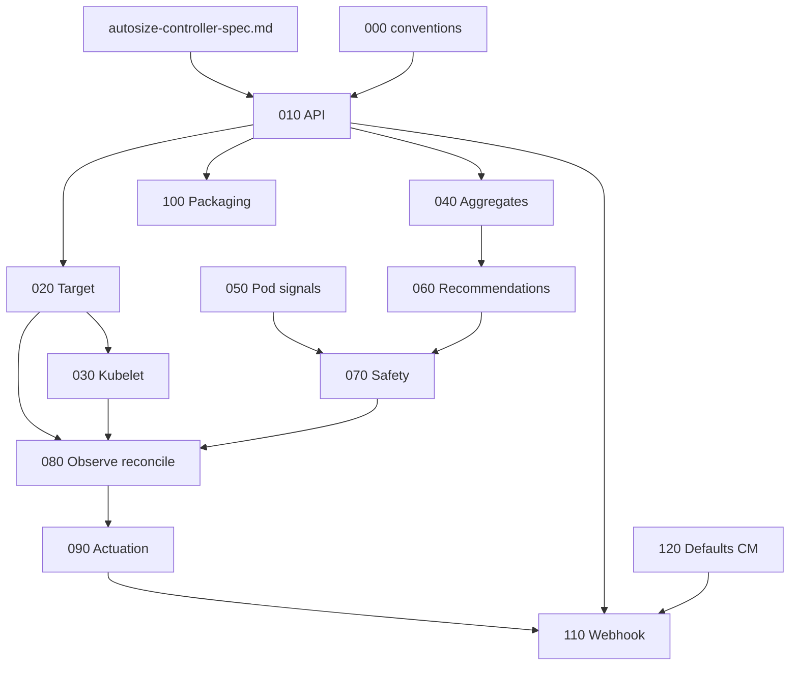

# Autosize controller — LLD index

Low-level designs for the deterministic autosizing controller. Requirements: [autosize-controller-spec.md](../../spec/autosize-controller-spec.md). Conventions: [000-doc-conventions.md](./000-doc-conventions.md).

## Status and tracking

| LLD | Document | Phase | Status | Issue |
|-----|----------|-------|--------|-------|
| 000 | [Conventions](./000-doc-conventions.md) | Foundation | reviewed | — |
| 010 | [WorkloadProfile API](./010-workloadprofile-api.md) | Core | draft | autosize-010 |
| 020 | [Target resolution](./020-target-resolution.md) | Core | draft | autosize-020 |
| 030 | [Kubelet stats client](./030-kubelet-stats-client.md) | Core | draft | autosize-030 |
| 040 | [Aggregate engine](./040-aggregate-engine.md) | Core | draft | autosize-040 |
| 050 | [Pod signals](./050-pod-signals.md) | Core | draft | autosize-050 |
| 060 | [Recommendation engine](./060-recommendation-engine.md) | Core | draft | autosize-060 |
| 070 | [Safety layer](./070-safety-layer.md) | Core | draft | autosize-070 |
| 080 | [Observe reconcile](./080-observe-reconcile.md) | Core | draft | autosize-080 |
| 090 | [Actuation](./090-actuation.md) | Core | draft | autosize-090 |
| 100 | [Packaging and RBAC](./100-packaging-rbac.md) | Core | draft | autosize-100 |
| 110 | [Admission webhook](./110-admission-webhook.md) | Admission | draft | autosize-110 |
| 120 | [Global defaults ConfigMap](./120-global-defaults-configmap.md) | Admission | draft | autosize-120 |
| 200 | [DRA integration](./200-dra-integration.md) | Future | stub | autosize-200 |
| 300 | [Node-aware optimization](./300-node-aware-optimization.md) | Future | stub | autosize-300 |
| 400 | [Time-based patterns](./400-time-based-patterns.md) | Future | stub | autosize-400 |

### Tracking issues

Use **one issue per LLD** (or one epic per phase with child issues). Suggested titles:

| Issue title | LLD |
|-------------|-----|
| `[LLD-000] Autosize LLD conventions and index` | 000 |
| `[LLD-010] WorkloadProfile CRD API` | 010 |
| `[LLD-020] Target resolution (Deployment / StatefulSet)` | 020 |
| `[LLD-030] Kubelet /stats/summary client` | 030 |
| `[LLD-040] Aggregate engine (EMA + DDSketch)` | 040 |
| `[LLD-050] Pod signals (OOM, restarts)` | 050 |
| `[LLD-060] Recommendation engine (modes, percentiles)` | 060 |
| `[LLD-070] Safety layer (cooldown, overrides, rationale)` | 070 |
| `[LLD-080] Observe-only reconcile` | 080 |
| `[LLD-090] Actuation (workload PATCH)` | 090 |
| `[LLD-100] Packaging, RBAC, observability baseline` | 100 |
| `[LLD-110] Admission webhook (cold-start inject)` | 110 |
| `[LLD-120] Global defaults ConfigMap` | 120 |
| `[LLD-200] DRA integration (future)` | 200 |
| `[LLD-300] Node-aware optimization (future)` | 300 |
| `[LLD-400] Time-based patterns (future)` | 400 |

Replace the **Issue** column in the table above with your tracker ID (e.g. `https://github.com/org/repo/issues/42` or `#42`).

### Implementation PRs

Every implementation PR must:

1. Include **`LLD: docs/lld/autosize/NNN-name.md`** in the description (path to the design being implemented).
2. Update the **Status** column for that row to `implemented` when the slice is complete.

## Dependency graph

Edges mean “read / implement after upstream.”

- **110** depends on **010** (schema) and **090** (stable resource shape for injection).
- **120** supplies config consumed by **110** (and optionally **100**).

## Phase mapping (spec §15)

| Roadmap phase | LLDs |
|---------------|------|
| Phase 1 — Core MVP | 010–100 |
| Phase 2 — Admission | 110, 120 |
| Phase 3 — DRA | 200 |
| Phase 4 — Node-aware | 300 |
| Phase 5 — Time-based | 400 |
