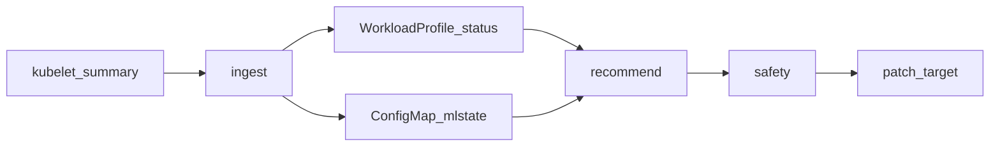

# Kubernetes Deterministic Autosizing Controller — Final Spec

## 1. Objective

A Kubernetes controller that dynamically adjusts CPU and memory requests/limits for workloads using deterministic, fully explainable algorithms. **No Prometheus dependency, no external SaaS, and no opaque ML services.** The shipped controller may use **in-cluster, bounded online methods** (CUSUM changepoint detection, EWMA feedback bias, Holt–Winters hourly forecasts, UTC quadrant DDSketches) with state persisted as structured JSON—see **§2 Extensions** and the learned-state summary in [`README.md`](../../README.md).

**No raw sample retention** and no reliance on external observability backends remain core properties.

**Comparable to CAST AI behavior — without the black box or SaaS dependency.**

Key differences from existing tools:

- **Goldilocks**: recommend-only, VPA-dependent, no actuation
- **CAST AI**: closed-source, ML-based, cloud-dependent
- **This**: self-contained actuation, no VPA, no Prometheus, deterministic + auditable (including post-MVP in-cluster extensions below)

---

## 2. Scope

### Included

- Deployments, StatefulSets
- Pods (indirect via controllers)
- Native Kubernetes metrics APIs (kubelet `/stats/summary`, not Metrics Server for history)
- Mutating admission webhook (cold-start defaults)

### Excluded

- Horizontal Pod Autoscaling
- Prometheus / external observability
- **External** ML services, hosted model APIs, or **opaque** probabilistic black boxes (see **Extensions** for allowed in-cluster deterministic methods)
- Direct Pod mutation
- DRA (Phase 2+)

### Extensions (post-MVP, in-repo)

The product excludes **external** ML and Prometheus. The implementation adds **in-cluster, deterministic** extensions that stay bounded and auditable:

- **`spec.collectionIntervalSeconds`** — reconcile requeue cadence after successful cycles (default **30s**, range **10–300**); kubelet-total-failure backoff uses **`max(10s, collectionInterval)`** (see §5).
- **Per-container UTC quadrant sketches** — up to four base64 DDSketches per CPU/memory for 6-hour UTC buckets (00–06, 06–12, 12–18, 18–24); recommendation prefers quadrant quantiles when the active bucket sketch has enough samples (see §6).
- **Learned state** (`ConfigMap` **`mlstate-<WorkloadProfile.metadata.name>`**, same namespace, owner-referenced for GC) — JSON holding CUSUM accumulators, per-container feedback EWMA ratios, and Holt–Winters state — all **online**, **no external datastore**.

**What lives where:** EMA, global DDSketches, quadrant sketches, slope fields, OOM/restart signals, and recommendations live in **`WorkloadProfile.status`**. CUSUM, feedback, and HW internals live **only** in the `mlstate-*` ConfigMap (inspectable there; optional **Kubernetes Events** may record changepoint shifts). Actuation decisions remain traceable via **`status.recommendations[].rationale`** and **conditions**.

Further detail: [`docs/implementation-status.md`](../implementation-status.md), [`docs/LLD/autosize/400-time-based-patterns.md`](../LLD/autosize/400-time-based-patterns.md), [`docs/LLD/autosize/070-safety-layer.md`](../LLD/autosize/070-safety-layer.md).

---

## 3. Architecture

```
┌─────────────────────────────────────────────┐
│              Kubebuilder Controller          │
│                                             │
│  ┌─────────────┐    ┌────────────────────┐  │
│  │   Reconciler │    │  Admission Webhook  │  │
│  │  (main loop) │    │  (cold-start inject)│  │
│  └──────┬──────┘    └────────────────────┘  │
│         │                                   │
│  ┌──────▼──────────────────────────────┐    │
│  │           Metrics Collector          │    │
│  │  kubelet /stats/summary (per node)   │    │
│  │  Pod status (OOMKill, restarts)      │    │
│  └──────┬──────────────────────────────┘    │
│         │                                   │
│  ┌──────▼──────────────────────────────┐    │
│  │         Stats Engine                 │    │
│  │  EMA, DDSketch, UTC quadrant buckets │    │
│  │  + load/save mlstate ConfigMap       │    │
│  └──────┬──────────────────────────────┘    │
│         │                                   │
│  ┌──────▼──────────────────────────────┐    │
│  │  WorkloadProfile status + mlstate CM │    │
│  │  Bounded aggregates — no raw samples │    │
│  └─────────────────────────────────────┘    │
└─────────────────────────────────────────────┘
```



---

## 4. Custom Resource Definition

**Canonical API group (this repository):** `autosize.saturdai.auto/v1`. Earlier drafts used the placeholder group `autosize.io`; all copy-paste YAML and RBAC must use the group from [`PROJECT`](../../PROJECT) / generated CRDs.

```yaml
apiVersion: autosize.saturdai.auto/v1
kind: WorkloadProfile
metadata:
  name: my-app
  namespace: production
spec:
  targetRef:
    kind: Deployment       # Deployment | StatefulSet
    name: my-app
  mode: balanced           # cost | balanced | resilience | burst
  containers:
    - name: app            # optional per-container overrides
      minCPU: "50m"
      maxCPU: "4000m"
      minMemory: "64Mi"
      maxMemory: "8Gi"
  cooldownMinutes: 15      # default: 15
  collectionIntervalSeconds: 30   # optional; 10–300; successful reconcile RequeueAfter
status:
  conditions:
    - type: TargetResolved
      status: "True"
      reason: Resolved
      message: target found
      lastTransitionTime: "2026-04-11T10:00:00Z"
      observedGeneration: 3
    - type: MetricsAvailable
      status: "True"
      reason: Collected
      message: metrics processed
      lastTransitionTime: "2026-04-11T10:00:05Z"
      observedGeneration: 3
    - type: ProfileReady
      status: "True"
      reason: Ready
      message: target resolved and metrics available
      lastTransitionTime: "2026-04-11T10:00:05Z"
      observedGeneration: 3
  containers:
    - name: app
      stats:
        cpu:
          emaShort: 120.5
          emaLong: 95.0
          sketch: ""       # base64 DDSketch protobuf when populated
          quadrantSketches: []   # omit or []; up to 4 entries, indices 0–3 = UTC 00–06 … 18–24
          lastUpdated: "2026-04-11T10:00:05Z"
        memory:
          emaShort: 268435456.0
          emaLong: 251658240.0
          sketch: ""
          quadrantSketches: []
          lastUpdated: "2026-04-11T10:00:05Z"
          slopeStreak: 0
          slopePositive: false
        lastOOMKill: null
        restartCount: 0
  metricsRecommendations:
    - containerName: app
      cpuRequest: "200m"
      cpuLimit: "800m"
      memoryRequest: "300Mi"
      memoryLimit: "600Mi"
      rationale: "balanced: engine output before safety (P70/P95, mode=balanced)"
  recommendations:
    - containerName: app
      cpuRequest: "200m"
      cpuLimit: "800m"
      memoryRequest: "256Mi"
      memoryLimit: "512Mi"
      rationale: "balanced: …; safety: decrease_step mem_request 300Mi->256Mi (floor 70%); trend_guard: memory frozen on workload"
  lastApplied: "2026-04-11T09:45:00Z"
  lastEvaluated: "2026-04-11T10:00:05Z"
  downsizePauseCyclesRemaining: 1   # example: restart-spike pause; decremented each reconcile when > 0
```

Learned JSON (**CUSUM**, **feedback**, **Holt–Winters**) is **not** shown above; it lives in ConfigMap `mlstate-my-app` in the same namespace (key `state`, see §6).

### Bulk target selection (not yet in generated CRD schema)

**Engineering detail:** [LLD-085](../LLD/autosize/085-bulk-target-selection.md). *Implementation status:* [implementation-status.md](../implementation-status.md).

When shipped, `spec` uses **exactly one** of:

| Mode | Semantics |
|------|-----------|
| **Named ref** | Current shape: `targetRef` names one `Deployment` or `StatefulSet` in the **same namespace** as the `WorkloadProfile`. |
| **Selector** | `targetSelector` lists `Deployment` / `StatefulSet` objects in that namespace by **labels**, and/or an **explicit opt-in** to select every such workload in the namespace (high blast radius — must be gated in API validation). |

**Cluster-wide** selection (namespaces + labels) may be a **separate cluster-scoped kind** or an extended schema; see LLD-085 options A/B.

**Conflicts:** If two profiles would manage the same workload via overlapping selectors, the default policy is **deny**: surface failure (e.g. `TargetResolved=False` or a dedicated condition) and **do not** actuate until resolved — see LLD-085.

**Invariants:** Selection resolves only to **parent workloads** (`Deployment` / `StatefulSet`), never to Pods directly (§16). Reconcile may **fan out** to multiple internal or child profiles; kubelet and aggregate behavior stay per workload.

### Status conditions

`status.conditions` (Kubernetes-style) include at least:

| Type | True when |
|------|-----------|
| `TargetResolved` | Named `targetRef`: the referenced Deployment/StatefulSet exists and was resolved. Selector path (when implemented): at least one matching workload exists **and** selector conflict policy is satisfied — see [LLD-085](../LLD/autosize/085-bulk-target-selection.md). |
| `MetricsAvailable` | Kubelet stats were collected for this evaluation cycle when required (pods scheduled to nodes), and aggregates/recommendations were updated |
| `ProfileReady` | `TargetResolved` **and** `MetricsAvailable` are both True |

If kubelet summary fetch fails for **all** nodes that host scheduled pods, set `MetricsAvailable=False` (reason such as `KubeletUnavailable`), **do not** advance `lastEvaluated` or emit a successful “metrics processed” outcome for that cycle; return **`RequeueAfter: max(10s, spec.collectionIntervalSeconds)`** with **nil error** so the requeue applies (controller-runtime ignores `RequeueAfter` when `err != nil`).

---

## 5. Metrics Collection

### Source: kubelet `/stats/summary`

**Do not rely on `metrics.k8s.io` (Metrics Server) for history** — it provides only instantaneous snapshots with no throttling data and no retention.

Access per node:

```
GET https://<node-ip>:10250/stats/summary
```

Requires `nodes/stats` RBAC permission.

### Signals Per Container

| Signal | Source | Notes |
|---|---|---|
| CPU usage (millicores) | kubelet summary | `usageNanoCores / 1e6` |
| Memory usage (bytes) | kubelet summary | `workingSetBytes` |
| CPU throttling | kubelet summary | `throttledUsageNanoCores` — not always populated |
| OOMKilled | Pod `containerStatuses[].lastState.terminated.reason` | Watch for `"OOMKilled"` |
| Restart count | Pod `containerStatuses[].restartCount` | Delta between reconciles |

### Collection interval (`spec.collectionIntervalSeconds`)

- **Validation:** 10–300 seconds; **default 30** if omitted (see generated CRD).
- **Successful reconcile:** `RequeueAfter` equals the configured interval (`defaults.CollectionInterval` in code).
- **Kubelet unavailable (all nodes with scheduled pods fail):** `RequeueAfter` is **`max(10s, collectionInterval)`** — never below 10s even if the spec interval is shorter.

---

## 6. State Storage: Bounded Aggregates, No Raw Samples

**Problem**: 24h of 30s samples = 2880 samples/container. Storing raw samples hits etcd's ~1MB object limit.

**Solution**: Online algorithms — fixed-size **CRD `status`** fields for observables operators care about, plus optional **in-namespace ConfigMap** JSON for additional learned parameters. **No external observability database.**

Canonical field names and validation match [`api/v1/workloadprofile_types.go`](../../api/v1/workloadprofile_types.go) and the generated CRD under `config/crd/bases/`.

### EMA (per metric)

Conceptually two exponentials on each sample (short vs long α in the aggregate package). Persisted as `emaShort` / `emaLong` on CPU and memory.

```
EMA_t = α * sample_t + (1 - α) * EMA_(t-1)
```

### Percentile state: DDSketch

Library: `github.com/DataDog/sketches-go/ddsketch`

- Bounded memory (~1KB per metric at 1% relative accuracy)
- Serializes to protobuf → **base64** in `status.containers[].stats.*.sketch`
- Mergeable: `(*ddsketch.DDSketch).MergeWith` combines sketches for the same relative-accuracy default mapping (see LLD-300).

```go
import "github.com/DataDog/sketches-go/ddsketch"

sketch, _ := ddsketch.NewDefaultDDSketch(0.01) // 1% relative accuracy
sketch.Add(sampleValue)
bytes, _ := sketch.ToProto().Marshal()
encoded := base64.StdEncoding.EncodeToString(bytes)
```

### Phase 4 — Per-node sketches and bin-packing hints (shipped)

- **`status.containers[].stats.nodeSketches`:** bounded list (max **32**) of `{ nodeName, lastSeen, cpuSketch, memSketch }` — each sketch is base64 DDSketch for **per-node** mean usage of that container (pods on that node averaged per reconcile).
- **Workload-level mean** (mean of per-node values, equivalent to averaging across pods) remains the single sample for **global** CPU/memory sketches, **EMA**, **CUSUM**, **quadrant** buckets, and **Holt–Winters** — same time series as pre–Phase 4.
- **Recommendations (§8):** percentile queries use **merged** per-node CPU/memory sketches when at least one `nodeSketches` entry exists; otherwise **global** sketches. Quadrant override (§6) still applies when the active quadrant sketch has enough samples.
- **`status.binPacking`:** read-only hints (`heteroScore`, `nodeCount`, `observedAt`) for external automation; does not mutate pods or scheduler config. See [`LLD-300`](../LLD/autosize/300-node-aware-optimization.md).

### CRD `status` shapes (per container)

Go types mirror JSON; **slope fields apply to memory only.**

```go
type CPUStats struct {
    EMAShort         float64      `json:"emaShort"`
    EMALong          float64      `json:"emaLong"`
    Sketch           string       `json:"sketch"`
    QuadrantSketches []string     `json:"quadrantSketches,omitempty"` // max 4
    LastUpdated      *metav1.Time `json:"lastUpdated,omitempty"`
}

type MemoryStats struct {
    EMAShort         float64      `json:"emaShort"`
    EMALong          float64      `json:"emaLong"`
    Sketch           string       `json:"sketch"`
    QuadrantSketches []string     `json:"quadrantSketches,omitempty"`
    LastUpdated      *metav1.Time `json:"lastUpdated,omitempty"`
    SlopeStreak      int32        `json:"slopeStreak,omitempty"`
    SlopePositive    bool         `json:"slopePositive"`
}

type ContainerResourceStats struct {
    CPU          CPUStats     `json:"cpu"`
    Memory       MemoryStats  `json:"memory"`
    NodeSketches []NodeSketchEntry `json:"nodeSketches,omitempty"` // max 32; Phase 4
    LastOOMKill  *metav1.Time `json:"lastOOMKill,omitempty"`
    RestartCount int32        `json:"restartCount"`
}
```

**Estimated CRD size**: order of tens of KB for many containers; per-node list capped at 32 nodes. Well within etcd limits.

### UTC quadrant sketches (CRD `status`)

- Up to **four** base64 DDSketches per **CPU** and per **memory**: index **0 → 00:00–06:00 UTC**, **1 → 06–12**, **2 → 12–18**, **3 → 18–24**.
- **Active bucket** each reconcile: `UTC_hour / 6` (integer division). Samples append to that bucket’s sketch.
- **Recommendation:** if the active quadrant sketch exists and `GetCount() >= 30` (`minQuadrantSketchCount` in `internal/recommend`), quantiles for that resource are taken from the **quadrant** sketch; otherwise the **global** sketch is used.
- **CUSUM shift** on a resource: global sketch for that resource is cleared and quadrant sketches for that container are reset so aggregation restarts clean (see `internal/controller/reconcile_ingest.go`, `reconcile_ml_helpers.go`).

### ConfigMap `mlstate-<profile.name>` (not CR `status`)

- **Namespace:** same as the `WorkloadProfile`. **Owner reference** to the profile for garbage collection.
- **Data key:** `state` — JSON object with top-level maps **`cusum`**, **`feedback`**, **`hw`** (see `internal/mlstate/types.go`).
- **`cusum`:** per container name → per-resource CUSUM accumulators (`sPos`, `sNeg`) for CPU and memory.
- **`feedback`:** per container → EWMA of **observed usage / prior post-safety recommendation** (CPU millicores and memory bytes); ratios are **clamped** when persisted so corrupt values cannot break marshaling (`internal/recommend/feedback.go`).
- **`hw`:** per container → Holt–Winters `HWState` per resource (`level`, `trend`, 24 seasonal indices, smoothing params, sample count) — `internal/aggregate/holtwinters.go`.
- **Corrupt or missing JSON on load:** reconciler starts from **fresh** in-memory state (see `docs/implementation-status.md`).

### Changepoint (CUSUM)

- Each ingest compares the **new sample** to **pre-update `emaLong`** for that resource (`changepoint.State.Update`).
- Default tunings (implementation): **CPU** allowance/threshold **K=25, H=125** (millicore-scale); **memory** byte-scale defaults in `internal/changepoint/cusum.go` (`DefaultMemConfig`).
- On detection: accumulators **reset**; optional **Event** when a recorder is wired (`cmd/main.go`); **global sketch cleared** and **quadrants cleared** for the affected resource path.

### Holt–Winters vs roadmap Phase 5

- **Shipped:** hourly triple exponential smoothing produces **forecasts** (`ForecastCPU` / `ForecastMem` in `recommend.Input`) used for headroom in **burst** / **resilience** modes when the forecast is **> 0** and warm.
- **Not shipped (Phase 5):** 24 separate “sketch slots” per container with **automatic profile switching** (cost vs burst by clock). Quadrant sketches are **four** UTC buckets for quantiles, not that product.

---

## 7. Statistical Model

Percentile targets (§8) read from the **merged per-node** CPU/memory sketches when `nodeSketches` is non-empty; otherwise the **global** sketch; **quadrant** override applies per §6 when the active quadrant sketch has enough samples. **Holt–Winters forecasts** (when warm) and **feedback bias** adjust recommendation inputs in code paths documented in `internal/recommend`.

### Prediction

```
baseline   = EMA_long
burst      = EMA_short - EMA_long
prediction = baseline + k * burst
```

`k` is tuned per profile (see Section 8).

### Slope Detection (memory only)

Track whether memory EMA short is monotonically increasing across reconcile cycles. After each reconcile, compare the **new** `EMA_short` (after ingesting the sample) to the **prior** `EMA_short` persisted in status from the previous reconcile. If `EMA_short_t > EMA_short_(t-1)` increment `slopeStreak`, else reset `slopeStreak` to 0. When `slopeStreak >= N`, set `slopePositive = true` → block downsizing (§9). **Default N = 5** (`aggregate.DefaultMemorySlopeCycles` in code). On cold start (no `memory.lastUpdated` yet), do not treat the first observation as an increase—`slopeStreak` stays 0. `slopeStreak` and `slopePositive` are stored in status so controller restarts continue the streak.

---

## 8. Profiles

Primary outputs are **DDSketch percentile queries** on the sketch selected by §6 (global vs quadrant). Forecasts and bias may modify limits/requests in **burst** / **resilience** per implementation.

### cost

```
cpuRequest  = P50
cpuLimit    = P90
memRequest  = P50
memLimit    = P90
k           = 0.5
```

### balanced (default)

```
cpuRequest  = P70
cpuLimit    = P95
memRequest  = P70
memLimit    = P95
k           = 1.0
```

### resilience

```
cpuRequest  = P90
cpuLimit    = P99 * 1.1
memRequest  = P90
memLimit    = P99 * 1.2
k           = 1.5
```

### burst

```
cpuRequest  = P40
cpuLimit    = max(P99, peak_observed)
memRequest  = P40
memLimit    = peak_observed
k           = 2.0
```

---

## 9. Safety Mechanisms

### Change Limits

- Max decrease per cycle: **30%**
- Max increase: unrestricted (fast recovery from under-provisioning)
- Hard floor from `spec.containers[].min*` values

### Cooldown

- Default: 15 minutes between patch applications
- Tracked via `status.lastApplied`

### Event Overrides (immediate, bypass cooldown)

| Event | Action |
|---|---|
| OOMKilled | `memLimit *= 1.5`, mark applied |
| High CPU throttling (>50%) | `cpuLimit += 25%` |
| Restart spike (delta > 3) | Pause downsizing for 2 cycles |

### Trend Guard

When `slopePositive == true` for a container’s memory aggregate (§7):

- **Actuation:** do **not** PATCH memory request/limit for that container — keep the workload’s current template memory (CPU may still update).
- **Safety:** do not apply the 30% decrease **clamp** to memory for that container; engine output may still appear in `status.metricsRecommendations` / `status.recommendations` with a `trend_guard` note in rationale for traceability.

This is **not** “strip memory from status”; it is **freeze memory on the workload** until the trend guard clears.

- **Wording:** Informal “skip memory recommendation” here means **skip applying memory decrease clamps and skip memory PATCH** — not “omit memory from the engine output” in 060.

### Rationale Field

Every recommendation in `status.recommendations[].rationale` must be a human-readable string explaining the decision. **`status.recommendations`** holds values **after** safety rules (including the 30% decrease floor). Sketch-only outputs are mirrored on **`status.metricsRecommendations`** (pre-safety) when present so operators can compare engine output to effective values.

```
"balanced: P70=230m cpu, P95=890m cpu, no OOM in 24h, cooldown satisfied"
"override: OOMKill detected 3m ago, memory x1.5 applied"
"; safety: decrease_step cpu_request 98m->70m (floor 70% of current 100m)"
```

---

## 10. Reconciliation Loop

Pseudocode aligned with `internal/controller/workloadprofile_controller.go` + `reconcile.go`. **Important:** when `err != nil`, controller-runtime **ignores** `RequeueAfter`; kubelet-total-failure therefore returns **`nil` error** with a custom requeue duration.

```go
func (r *WorkloadProfileReconciler) Reconcile(ctx context.Context, req ctrl.Request) (ctrl.Result, error) {
    profile := &autosizev1.WorkloadProfile{}
    if err := r.Client.Get(ctx, req.NamespacedName, profile); err != nil {
        return ctrl.Result{}, client.IgnoreNotFound(err)
    }

    customRequeue, err := r.reconcile(ctx, profile) // inner loop
    if err != nil {
        return ctrl.Result{}, err // no RequeueAfter
    }
    if customRequeue != nil {
        return ctrl.Result{RequeueAfter: *customRequeue}, nil // e.g. kubelet backoff max(10s, interval)
    }
    return ctrl.Result{RequeueAfter: requeueAfter(profile)}, nil // spec collection interval
}

// reconcile (sketch):
//  - resolve target; set TargetResolved; persist on not-found / error paths as implemented
//  - list pods, fetch kubelet summaries per node
//  - if pods scheduled but every fetch failed: MetricsAvailable=False, persist status,
//    return &metricsRequeueAfter(profile), nil
//  - mlState := New(); if MLState repo != nil { Load(profile) }
//  - for each template container: ingestContainerMetrics (EMA, sketches, quadrants, CUSUM, HW, forecasts)
//  - pruneMLState to active container names
//  - compute engine recommendations → status.metricsRecommendations
//  - safety.Apply → status.recommendations, LastEvaluated, MetricsAvailable=True, ProfileReady
//  - persist status; if MLState repo != nil { Save(profile, mlState) }
//  - optional actuation (env-gated): patch target, LastApplied, persist again
//  - return nil, nil to use default RequeueAfter(interval)
```

**Bulk selection (future):** If `spec` uses a selector instead of a single `targetRef`, the controller resolves **one or more** workloads before listing pods and collecting metrics ([LLD-085](../LLD/autosize/085-bulk-target-selection.md)). The loop above applies **per resolved target** (or per fan-out `WorkloadProfile`), including actuation and `mlstate-*` naming rules.

---

## 11. Mutation Strategy

### Apply via

- `PATCH /apis/apps/v1/namespaces/{ns}/deployments/{name}` — container resources in pod template
- Triggers rolling update automatically

### Never

- Mutate Pods directly — controllers own Pods

### Admission Webhook (cold-start)

- Mutating webhook on Pod create
- If `WorkloadProfile` exists for the owning controller → inject last known recommendation
- If no profile exists → inject conservative defaults (configurable global fallback)

```go
// Webhook injects into pod.spec.containers[].resources
// before the pod is scheduled — eliminates the gap between
// profile creation and first reconcile cycle
```

---

## 12. Edge Cases

| Case | Handling |
|---|---|
| Cold start (no data) | Webhook injects defaults; EMA bootstraps from first sample |
| Noisy workloads | Use `resilience` profile (P95+) |
| CronJobs | Use `burst` profile; detect idle periods via near-zero EMA |
| Memory leak | `slopePositive` detection blocks downsizing |
| Controller restart | **CR `status`** retains EMA, sketches, quadrants, slope, recommendations. **CUSUM, feedback, HW** reload from ConfigMap `mlstate-*` (or start fresh if missing/corrupt) |
| No kubelet access | If every kubelet fetch fails for nodes with scheduled pods: `MetricsAvailable=False`, `ProfileReady=False`, persist status, **no** `lastEvaluated` update, requeue after `max(10s, collectionInterval)` with nil error so `RequeueAfter` applies |
| Partial kubelet (some nodes OK) | Use stats from successful nodes; complete pipeline when possible |

---

## 13. RBAC Requirements

Minimum logical rules below. The **implemented** ClusterRole is generated from `+kubebuilder:rbac` markers — see [`config/rbac/role.yaml`](../../config/rbac/role.yaml).

Kubelet metrics are read via the API server **node proxy** (`GET /api/v1/nodes/{name}/proxy/stats/summary`), which requires `nodes` **get/list/watch** and `nodes/proxy` **get** (not only `nodes/stats`).

```yaml
rules:
- apiGroups: [""]
  resources: ["pods"]
  verbs: ["get", "list", "watch"]
- apiGroups: [""]
  resources: ["nodes"]
  verbs: ["get", "list", "watch"]
- apiGroups: [""]
  resources: ["nodes/proxy"]
  verbs: ["get"]
- apiGroups: ["apps"]
  resources: ["deployments", "statefulsets"]
  verbs: ["get", "list", "watch", "patch"]
- apiGroups: [""]
  resources: ["configmaps"]
  verbs: ["get", "list", "watch", "create", "update", "patch", "delete"]
- apiGroups: ["autosize.saturdai.auto"]
  resources: ["workloadprofiles", "workloadprofiles/status"]
  verbs: ["get", "list", "watch", "create", "update", "patch"]
```

*(Events `create`/`patch` may be required when recording changepoint shifts; see generated [`config/rbac/role.yaml`](../../config/rbac/role.yaml).)*

---

## 14. Key Dependencies

| Dependency | Purpose |
|---|---|
| `sigs.k8s.io/controller-runtime` | Controller scaffolding (via Kubebuilder) |
| `github.com/DataDog/sketches-go/ddsketch` | Online percentile computation |
| `k8s.io/client-go` | Kubernetes API (including node proxy → kubelet summary) |
| `google.golang.org/protobuf` | DDSketch serialization |

No Prometheus. No VPA. **No external observability database** — optional **in-cluster ConfigMap** (`mlstate-*`) holds bounded learned JSON.

---

## 15. Roadmap

### Phase 1 — Core (MVP)

- WorkloadProfile CRD + controller
- Kubelet metrics collection
- EMA + DDSketch stats engine
- Profile-driven recommendations (all 4 modes)
- Safety mechanisms
- Deployment/StatefulSet patching

**Planned extension (not yet in generated CRD):** [Bulk target selection](../LLD/autosize/085-bulk-target-selection.md) — namespace / label / cluster-wide policy; spec §4; status [implementation-status.md](../implementation-status.md).

### Phase 2 — Admission Webhook

- Cold-start default injection
- Fallback global defaults configmap

### Phase 3 — DRA Integration

- ResourceClass tiers
- Controller-managed ResourceClaims
- Late binding for better bin-packing
- *(DRA API status: beta in k8s 1.30+, production readiness TBD)*

### Phase 4 — Node-Aware Optimization

- **Per-node DDSketches** in `status` (bounded), merged for percentile-based recommendations (**§6 Phase 4**).
- **Bin-packing hints** in `status.binPacking` (read-only JSON for operators / external tooling; **not** core scheduler API or DRA).
- Implementation: [`LLD-300`](../LLD/autosize/300-node-aware-optimization.md), [`implementation-status.md`](../implementation-status.md).

### Phase 5 — Time-Based Patterns

- Hour-of-day bucketing (24 sketch slots per container)
- Automatic burst/off-peak profile switching

**Shipped today:** four **UTC quadrant** sketches per resource and **Holt–Winters** hourly forecasts (§6) are **not** the Phase 5 auto–profile-switching feature; they support quantiles and headroom only. **Engineering contract** (shipped subset vs Phase 5 backlog): [`LLD-400`](../LLD/autosize/400-time-based-patterns.md).

**Low-level designs:** Per-subsystem engineering contracts (traceability, APIs, test plans) live under [`docs/LLD/autosize/`](../LLD/autosize/README.md), indexed by phase and dependency order.

---

## 16. Constraints (Non-Negotiable)

- No Prometheus dependency
- No **external** ML services, hosted inference, or **opaque** probabilistic black boxes; **in-cluster** deterministic online extensions (§2 Extensions, §6) are allowed and must remain **bounded and inspectable** (CR status + `mlstate` JSON + optional Events)
- **Actuation-facing** outputs: every entry in `status.recommendations[]` carries a human-readable **`rationale`**; **conditions** summarize readiness. Learned internals need not be duplicated in rationale but must not replace traceability of **what** was applied or **why** safety fired
- Decisions remain **reproducible** given the same persisted state and inputs (no network calls to third-party model APIs)
- Must not destabilize workloads (safety mechanisms always active)
- No raw sample storage — online algorithms and fixed-size sketches only
- No direct Pod mutation

### Traceability checklist (doc ↔ code)

| Spec topic | Primary implementation references |
|------------|-----------------------------------|
| §2 Extensions, §6 learned pipeline | `internal/mlstate`, `internal/changepoint`, `internal/aggregate/holtwinters.go`, `internal/recommend/feedback.go`, `internal/controller/reconcile_ingest.go` |
| Collection interval / requeue | `internal/defaults/defaults.go`, `internal/controller/reconcile.go` (`requeueAfter`, `metricsRequeueAfter`) |
| Quadrant selection / min count | `internal/controller/reconcile.go`, `internal/recommend/recommend.go` |
| §6 Phase 4 per-node sketches, `binPacking` | `internal/controller/reconcile.go`, `internal/controller/usage.go`, `internal/controller/node_sketches.go`, `internal/aggregate/merge.go` |
| Status API | `api/v1/workloadprofile_types.go`, generated CRD in `config/crd/bases/` |
| Shipped feature inventory | [`docs/implementation-status.md`](../implementation-status.md) |
